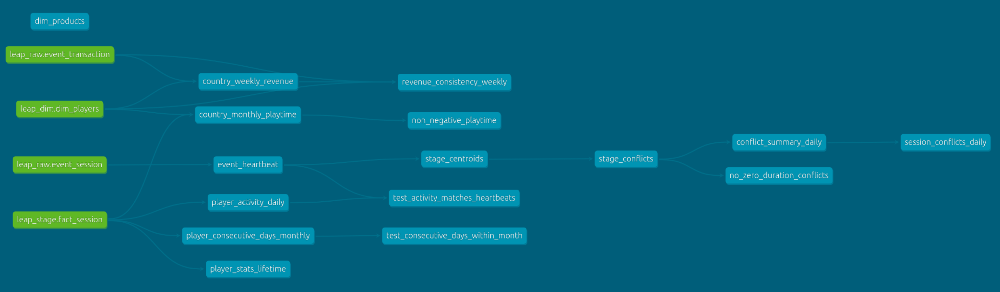

# Leap dbt Project



## 🗂️ Overview

This folder contains all **dbt models**, seeds, macros, and tests for the Leap analytics pipeline.  
The transformations here take raw game telemetry from DuckDB (`leap_raw`) and produce clean, analysis-ready marts in `leap_mart`.

---

## 📦 Structure

```bash
models/
├── staging/
│ ├── event_heartbeat.sql # Unpacks player heartbeat JSON
│ ├── stage_centroids.sql # Computes per-player centroid positions
│ ├── stage_conflicts.sql # Detects close conflicts from heartbeat data
│ ├── schema.yml # Contracts & tests for staging models
│
├── marts/
│ ├── country_monthly_playtime.sql
│ ├── country_weekly_revenue.sql
│ ├── conflict_summary_daily.sql
│ ├── player_activity_daily.sql
│ ├── player_consecutive_days_monthly.sql
│ ├── player_stats_lifetime.sql
│ ├── session_close_conflicts_daily.sql
│ ├── schema.yml # Contracts & tests for marts

seeds/
├── dim_products.csv # Static product dimension

macros/
├── compute_conflicts.sql # Reusable spatial/time gap logic

tests/
├── no_zero_duration_conflicts.sql # Data quality test example
```

---

## 🧠 Key Logic

- **Staging models** clean and standardize source events from `leap_raw` into `leap_stage`.
- **conflict detection** uses `compute_conflicts` macro to apply spatial proximity (≤ 50 units) and time gap (> 3 minutes) rules.
- **Mart models** roll up data to player, session, and country grains for downstream analysis.

---

## 🚀 Usage

From the project root:

```bash
dbt deps
dbt seed --select dim_products
dbt run
dbt test
```

---

## 📊 Target Schemas

**leap_stage**

- event_heartbeat
- fact_session
- stage_centroids
- stage_conflicts

**leap_mart**

- country_monthly_playtime
- country_weekly_revenue
- conflict_summary_daily
- player_activity_daily
- player_consecutive_days_monthly
- player_stats_lifetime
- session_close_conflicts_daily

---

> 📌 **Note**: This project demonstrates analytics pipeline design and implementation for a simulated gaming environment. All code, implementation details, and architectural decisions are original work created for educational and demonstration purposes only.
